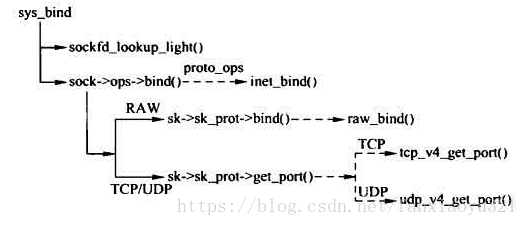

# Linux socket查找和reuseport介绍及ebpf解决方案

## 背景知识 <a href="#id-3-zong-jie-sock-jie-gou-socket-jie-gou-he-tcpsock-jie-gou-san-zhe-zhi-jian-de-guan-xi" id="id-3-zong-jie-sock-jie-gou-socket-jie-gou-he-tcpsock-jie-gou-san-zhe-zhi-jian-de-guan-xi"></a>

### socket

#### sock结构、socket结构和tcp\_sock结构三者之间的关系） <a href="#id-3-zong-jie-sock-jie-gou-socket-jie-gou-he-tcpsock-jie-gou-san-zhe-zhi-jian-de-guan-xi" id="id-3-zong-jie-sock-jie-gou-socket-jie-gou-he-tcpsock-jie-gou-san-zhe-zhi-jian-de-guan-xi"></a>

对于[struct socket](https://elixir.bootlin.com/linux/v6.10.2/source/include/linux/net.h#L117)和[struct sock](https://elixir.bootlin.com/linux/v6.10.2/source/include/net/sock.h#L341)，它们的区别在于，socket结构体是对应于用户态，是为应用层提供的统一结构，也就是所谓的general BSD socket。而sock结构体是对应于内核态，是socket在网络层的表示(network layer representation of sockets)。它们两者是一一对应的，在struct socket中有一个指针指向对应的struct sock。

最后用一张图大概描述一下这个几个结构体的关系。

我们后续讲解的都是内核中的流程，所以使用的都是struct sock。




### udp table

[udp\_table](https://elixir.bootlin.com/linux/v6.10.2/source/include/net/udp.h#L73)存储内核中的socket。

```c
/**
 *	struct udp_table - UDP table
 *
 *	@hash:	hash table, sockets are hashed on (local port)
 *	@hash2:	hash table, sockets are hashed on (local port, local address)
 *	@mask:	number of slots in hash tables, minus 1
 *	@log:	log2(number of slots in hash table)
 */
struct udp_table {
	struct udp_hslot	*hash;
	struct udp_hslot	*hash2;
	unsigned int		mask;
	unsigned int		log;
};
extern struct udp_table udp_table;
```

```c
/**
 *	struct udp_hslot - UDP hash slot
 *
 *	@head:	head of list of sockets
 *	@count:	number of sockets in 'head' list
 *	@lock:	spinlock protecting changes to head/count
 */
struct udp_hslot {
	struct hlist_head	head;
	int			count;
	spinlock_t		lock;
} __attribute__((aligned(2 * sizeof(long))));
```

其中hash/hash2是两个链表，按照不同的hash方式来存储socket。有两种hash方式，这两种hash方式存在的原因是使得socket分布更均衡？

* hash： local port
* hash2： local port, local address

这个table具体又是怎么维护的呢？我们另起一篇说。

### UDP socket绑定端口和udp\_tabel更新

对于UDP，UDP套接字的端口号绑定发生在三种场景

* 应用程序显示调用bind
* 客户端使用Connect连接服务器
* UDP创建套接字后直接使用sendto发送数据，这时内核自动为该套接字绑定一个可用端口

最终，他们都会调用统一个函数完成端口绑定socket。

<figure><figcaption></figcaption></figure>

用流程图来解释下都做了什么


### UDP数据包发送到哪个socket？

数据包查找socket过程，

我们先来看一下这个udp\_table是怎么用的：

如果查找socket的方式是只用port，那就查找hash链表，如果是local port + local address，那就查找hash2链表。

* mask：hash表中有多少个slot。

如何hash并查找的代码如下，示例为hash2

```c
hash2 = ipv4_portaddr_hash(net, daddr, hnum);
slot2 = hash2 & udptable->mask;
hslot2 = &udptable->hash2[slot2];

/* Lookup connected or non-wildcard socket */
result = udp4_lib_lookup2(net, saddr, sport,
            daddr, hnum, dif, sdif,
            hslot2, skb);
```

* 根据addr port计算hash值
* hash值\&mask，得到slot的索引
* 获取slot的头指针
* 在slot中查找符合条件的socket

再来看一下


socket得分

计算得分的一些标准

·接收端口：必须匹配。

·接收地址：如绑定了则必须匹配，分值为2分。

·对端目的地址：如设置了则必须匹配，分值为2分。

·对端目的端口：如设置了则必须匹配，分值为2分。

·网卡：如绑定了则必须匹配，分值为2分。

·套接字设置了PF\_INET协议族，分值为1分。



## 内核对reuseport的支持

## ebpf对socket查找的支持

`BPF_MAP_TYPE_SOCKMAP 底层实现是array`

```
struct bpf_stab {
        struct bpf_map map;
        struct sock **sks;
        struct sk_psock_progs progs;
        spinlock_t lock;
};

const struct bpf_map_ops sock_map_ops = {
	.map_meta_equal		= bpf_map_meta_equal,
	.map_alloc		= sock_map_alloc,
	.map_free		= sock_map_free,
	.map_get_next_key	= sock_map_get_next_key,
	.map_lookup_elem_sys_only = sock_map_lookup_sys,
	.map_update_elem	= sock_map_update_elem,
	.map_delete_elem	= sock_map_delete_elem,
	.map_lookup_elem	= sock_map_lookup,
	.map_release_uref	= sock_map_release_progs,
	.map_check_btf		= map_check_no_btf,
	.map_mem_usage		= sock_map_mem_usage,
	.map_btf_id		= &sock_map_btf_ids[0],
	.iter_seq_info		= &sock_map_iter_seq_info,
};
```

`BPF_MAP_TYPE_SOCKHASH 底层实现是hash`

```
struct bpf_shtab {
        struct bpf_map map;
        struct bpf_shtab_bucket *buckets;
        u32 buckets_num;
        u32 elem_size;
        struct sk_psock_progs progs;
        atomic_t count;
};
```

&#x20;这两个map都可以使用下面的helper来进行转发。

`bpf_sk_redirect_map()`, `bpf_sk_redirect_hash()`, `bpf_msg_redirect_map()` and `bpf_msg_redirect_hash()`.

当一个socket被插入到这两个map中时，socket的callbacks会被替换，并且会attach一个struct sk\_psock。sk\_psock继承了attach在map上的程序，这些程序支持的类型如下。

* `msg_parser` program - `BPF_SK_MSG_VERDICT`.
* `stream_parser` program - `BPF_SK_SKB_STREAM_PARSER`.
* `stream_verdict` program - `BPF_SK_SKB_STREAM_VERDICT`.
* `skb_verdict` program - `BPF_SK_SKB_VERDICT`.

函数实现在

```
sock_map_update_common
```


挂载到map的如下成员中，实现函数是sock\_map\_attach\_prog

```
struct sk_psock_progs {
        struct bpf_prog *msg_parser;
        struct bpf_prog *stream_parser;
        struct bpf_prog *stream_verdict;
        struct bpf_prog *skb_verdict;
};
```

参考文档：[https://docs.kernel.org/bpf/map\_sockmap.html](https://docs.kernel.org/bpf/map\_sockmap.html)


`BPF_MAP_TYPE_REUSEPORT_SOCKARRAY`

```
struct reuseport_array {
	struct bpf_map map;
	struct sock __rcu *ptrs[];
};
```

`bpf_sk_select_reuseport,BPF_PROG_TYPE_SK_REUSEPORT可以使用这个helper`

Since [ v5.8](https://github.com/torvalds/linux/commit/64d85290d79c0677edb5a8ee2295b36c022fa5df) [`BPF_MAP_TYPE_SOCKHASH`](https://ebpf-docs.dylanreimerink.nl/linux/map-type/BPF\_MAP\_TYPE\_SOCKHASH/) and [`BPF_MAP_TYPE_SOCKMAP`](https://ebpf-docs.dylanreimerink.nl/linux/map-type/BPF\_MAP\_TYPE\_SOCKMAP/) maps can also be used with this helper.

## ebpf对自定义reuseport选择算法的支持

能够影响socket select的地方有两个，分别是，并且是按照如下顺序的

```c
bpf_sk_lookup_run_v4 ---> BPF_PROG_TYPE_FLOW_DISSECTOR 4.20
inet_lookup_reuseport ---> BPF_PROG_TYPE_SK_REUSEPORT 4.19
```

ebpf挂载reuse port prog的过程

```
case SO_ATTACH_REUSEPORT_EBPF:
    sk_reuseport_attach_bpf
        reuseport_attach_prog
	    rcu_assign_pointer(sk->sk_reuseport_cb->prog, prog);
```

如果这个socket没有sk\_reuseport\_cb会分配一个，如果有会直接赋值。

最后遍历选择的socket的时候会去在socket中的reuseport（如果有）里面进行选择，选择的方式有BPF\_PROG\_TYPE\_SK\_REUSEPORT和bpf\_filter，如果没有bpf钩子，就会执行内核自己的选择算法。

```
if (prog->type == BPF_PROG_TYPE_SK_REUSEPORT)
        sk2 = bpf_run_sk_reuseport(reuse, sk, prog, skb, NULL, hash);
else
        sk2 = run_bpf_filter(reuse, socks, prog, skb, hdr_len);
```

reuseport ebpg prog挂载的地方如下图，attached to a `SO_REUSEPORT` socket group


所以挂载的时候，监听同一个端口的这些socket，只有第一个socket需要挂载ebpf程序



```
Following INET/TCP socket lookup changes, modify UDP socket lookup to let
BPF program select a receiving socket before searching for a socket by
destination address and port as usual.

Lookup of connected sockets that match packet 4-tuple is unaffected by this
change. BPF program runs, and potentially overrides the lookup result, only
if a 4-tuple match was not found.
```




reuseport挂载程序的点不在常规的skb->cb\[]上，而，是为了避免重复调用。以下引用自该功能特性[commit](https://github.com/torvalds/linux/commit/2dbb9b9e6df67d444fbe425c7f6014858d337adf)的描述

> At the SO\_REUSEPORT sk lookup time, it is in the middle of transiting from a lower layer (ipv4/ipv6) to a upper layer (udp/tcp). At this point, it is not always clear where the bpf context can be appended in the skb->cb\[48] to avoid saving-and-restoring cb\[]. Even putting aside the difference between ipv4-vs-ipv6 and udp-vs-tcp. It is not clear if the lower layer is only ipv4 and ipv6 in the future and will it not touch the cb\[] again before transiting to the upper layer. For example, in udp\_gro\_receive(), it uses the 48 byte NAPI\_GRO\_CB instead of IP\[6]CB and it may still modify the cb\[] after calling the udp\[46]\_lib\_lookup\_skb(). Because of the above reason, if sk->cb is used for the bpf ctx, saving-and-restoring is needed and likely the whole 48 bytes cb\[] has to be saved and restored. Instead of saving, setting and restoring the cb\[], this patch opts to create a new "struct sk\_reuseport\_kern" and setting the needed values in there.

所以reuseport prog引入了一个struct sk\_reuseport\_(kern|md)结构体

sk\_select\_reuseport()是唯一一个可以使用BPF\_MAP\_TYPE\_REUSEPORT\_ARRAY的func。

[参考资料](https://ebpf-docs.dylanreimerink.nl/)

helper函数，其实也是通过map\_lookup\_elem来查找socket，只不过是多做了一些检查。

```
BPF_CALL_4(sk_select_reuseport, struct sk_reuseport_kern *, reuse_kern,
       struct bpf_map *, map, void *, key, u32, flags)
{
    bool is_sockarray = map->map_type == BPF_MAP_TYPE_REUSEPORT_SOCKARRAY;
    struct sock_reuseport *reuse;
    struct sock *selected_sk;

    selected_sk = map->ops->map_lookup_elem(map, key);
    if (!selected_sk)
       return -ENOENT;

    reuse = rcu_dereference(selected_sk->sk_reuseport_cb);
    if (!reuse) {
       /* Lookup in sock_map can return TCP ESTABLISHED sockets. */
       if (sk_is_refcounted(selected_sk))
          sock_put(selected_sk);

       /* reuseport_array has only sk with non NULL sk_reuseport_cb.
        * The only (!reuse) case here is - the sk has already been
        * unhashed (e.g. by close()), so treat it as -ENOENT.
        *
        * Other maps (e.g. sock_map) do not provide this guarantee and
        * the sk may never be in the reuseport group to begin with.
        */
       return is_sockarray ? -ENOENT : -EINVAL;
    }

    if (unlikely(reuse->reuseport_id != reuse_kern->reuseport_id)) {
       struct sock *sk = reuse_kern->sk;

       if (sk->sk_protocol != selected_sk->sk_protocol)
          return -EPROTOTYPE;
       else if (sk->sk_family != selected_sk->sk_family)
          return -EAFNOSUPPORT;

       /* Catch all. Likely bound to a different sockaddr. */
       return -EBADFD;
    }

    reuse_kern->selected_sk = selected_sk;

    return 0;
}
```

## 总结

下次看代码的时候，先搞清楚涉及到的各个结构体是什么含义，结构体之间是什么关系，遇到函数可以先搜一下，看是否有现成的讲解。

根据函数的commit来看代码作用。
